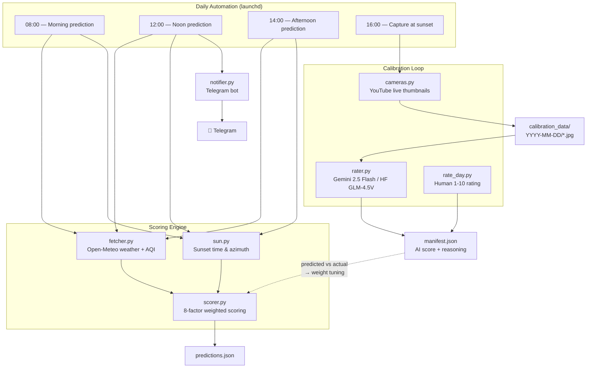

# Sunset Predictor

**Will tonight's sunset be worth going outside for?**

A scoring engine that predicts sunset quality (1-10) for Tel Aviv using weather data, captures webcam frames to verify predictions with Vision AI, sends daily alerts via Telegram, and auto-posts to Instagram. Built entirely on free APIs, runs locally on macOS.

> First calibration result: predicted **6.8**, AI rated **6.5**, human rated **6.0** — the model is already in the ballpark, and the feedback loop is working.

---

## How the Scoring Model Works

The engine scores 8 weather factors on a 1-10 scale, then combines them with tuned weights. Some of the relationships are counter-intuitive:

| Factor | Weight | The Insight |
|--------|--------|-------------|
| **High clouds (cirrus)** | 20% | High clouds are *good*. Ice crystals at 6km+ refract light into vivid reds and oranges. 20-50% high cloud cover is the single best predictor of a spectacular sunset. |
| **Low/mid clouds** | 10% | Low clouds are bad. They sit at the horizon and block the sun. Heavy mid clouds dim the show. |
| **Western sky (near)** | 20% | What's happening 25km west in the sunset direction? Overcast there kills the show. Scattered clouds catch light beautifully. |
| **Western sky (far)** | 10% | 80km out — are there clouds to serve as a color canvas? Scattered-to-broken is ideal. |
| **Air quality** | 10% | Counter-intuitive: perfectly clean air (PM2.5 < 5) scores *lower* than moderate aerosols (15-35). Some particulates enhance scattering and warm the palette. Too much = haze. |
| **Humidity** | 10% | Dry air lets light travel cleanly. Above 80% humidity, moisture scatters light diffusely and washes out colors. |
| **Visibility** | 10% | High visibility means the atmosphere is clear enough for sunlight to reach you with color intact. |
| **Weather condition** | 15% | Precipitation is always bad. "Scattered clouds" (WMO 802) is the perfect condition — enough cloud canvas without blocking the sun. |

### Verdicts

| Score | Verdict |
|-------|---------|
| 8.0+  | Tell your friends — rare show |
| 6.5-7.9 | Worth making plans for |
| 5.0-6.4 | Watchable — sun meets the sea |
| 3.5-4.9 | Probably blocked or dull |
| < 3.5 | Skip it |

---

## Architecture



### The Calibration Loop

The system doesn't just predict — it learns:

1. **Predict** — Score tonight's sunset using weather data (4 times daily, tracking prediction drift)
2. **Capture** — Grab webcam frames at sunset-10, sunset, sunset+10, sunset+20 minutes
3. **Rate** — Vision AI (Gemini primary, HuggingFace fallback) scores each frame 1-10
4. **Compare** — Human rating + AI rating + model prediction = three-way calibration signal
5. **Adjust** — Use the delta to retune scoring weights (manual for v1, automated later)

---

## Tech Stack

Everything runs for free:

| Component | Technology | Cost |
|-----------|-----------|------|
| Weather data | [Open-Meteo](https://open-meteo.com/) | Free, no key required |
| Air quality | Open-Meteo AQI endpoint | Free |
| Webcam capture | YouTube live thumbnail trick | Free |
| Vision AI (primary) | Gemini 2.5 Flash | Free tier (20 req/day) |
| Vision AI (fallback) | HuggingFace GLM-4.5V | Free credits |
| Notifications | Telegram Bot API | Free |
| Instagram posting | [instagrapi](https://github.com/subzeroid/instagrapi) | Free |
| Image generation | [Pillow](https://python-pillow.org/) | Free |
| Automation | macOS launchd | Built-in |
| Language | Python 3.9 | - |

---

## Project Layout

```
sunset-predictor/
├── main.py                    # Single prediction to console
├── daily_sunset.py            # Daily pipeline: predict + capture + rate + notify + post
├── post_sunset.py             # Instagram posting (prediction card or sunset photo)
├── calibrate.py               # Batch Vision AI rating for historical images
├── capture_sunset.py          # Legacy predict + capture
├── backtest.py                # Historical scoring to CSV
├── rate_day.py                # Human rating CLI
├── retro_review.py            # 7-day calibration report with drift analysis
├── discover_cameras.py        # Find YouTube live webcams
│
├── sunset_predictor/
│   ├── scorer.py              # 8-factor weighted scoring engine
│   ├── fetcher.py             # Open-Meteo weather + AQI fetching
│   ├── sun.py                 # Sunset time, azimuth, western sky geometry
│   ├── cameras.py             # Webcam registry (YouTube thumbnails)
│   ├── rater.py               # Vision AI rating (Gemini + HuggingFace)
│   ├── notifier.py            # Telegram notification
│   ├── poster.py              # Instagram posting (cards, overlays, captions)
│   ├── formatter.py           # CLI output formatting
│   └── config.py              # Location config (Tel Aviv)
│
├── tests/                     # 225 pytest tests
├── launchd/                   # macOS scheduled job plists
├── calibration_data/
│   └── example/               # Sample day with prediction, AI rating, and image
└── docs/
    ├── spec.md                # Full project spec
    ├── plan.md                # Implementation plan
    ├── product_doc.md         # Product context
    └── future_vision.md       # Roadmap: Instagram, push app, multi-city
```

---

## Setup

### Prerequisites

- Python 3.9+
- macOS (for launchd automation; the predictor itself runs anywhere)

### Install

```bash
git clone https://github.com/YOUR_USERNAME/sunset-predictor.git
cd sunset-predictor
python3 -m venv .venv
source .venv/bin/activate
pip install -r requirements.txt
```

### Configure (optional)

Copy `.env.example` to `.env` and fill in any keys you want:

```bash
cp .env.example .env
```

| Variable | Required? | Purpose |
|----------|-----------|---------|
| `TELEGRAM_BOT_TOKEN` | For notifications | From [@BotFather](https://t.me/BotFather) |
| `TELEGRAM_CHAT_ID` | For notifications | Your chat ID |
| `GEMINI_API_KEY` | For Vision AI | From [Google AI Studio](https://aistudio.google.com/) |
| `HUGGINGFACE_API_KEY` | For Vision AI fallback | From [HuggingFace](https://huggingface.co/settings/tokens) |
| `INSTAGRAM_USERNAME` | For auto-posting | New Instagram account |
| `INSTAGRAM_PASSWORD` | For auto-posting | Account password |

The predictor works without any API keys — you just won't get Telegram alerts, Vision AI ratings, or Instagram posts.

---

## Usage

### Get a prediction

```bash
python3 main.py
```

### Run the daily pipeline

```bash
python3 daily_sunset.py                  # Log a prediction
python3 daily_sunset.py --notify         # Log + send to Telegram
python3 daily_sunset.py --capture --now  # Log + capture webcam frames now
```

### Post to Instagram

```bash
python3 post_sunset.py --prediction --dry-run  # Generate card without posting
python3 post_sunset.py --prediction             # Post noon prediction card
python3 post_sunset.py --photo                  # Post evening sunset photo
```

### Rate images with Vision AI

```bash
python3 calibrate.py --date 2026-02-25
```

### Set a human rating

```bash
python3 rate_day.py --date 2026-02-25 --score 7.5 --notes "great gap sunset"
```

### Install daily automation (macOS only)

```bash
bash launchd/install.sh    # 4 jobs: 08:00, 12:00+notify+post, 14:00, 16:00+capture+post
bash launchd/uninstall.sh  # Remove all jobs
```

### Run tests

```bash
python3 -m pytest tests/ -v  # 225 tests
```

---

## Example Output

A sample day's data lives in `calibration_data/example/` — prediction, AI rating, webcam frame, and human rating all in one place.

```
Score: 6.8 / 10 — Worth making plans for
Sunset: 17:35 (azimuth 260°)

  High clouds    ████░░░░░░  4.0  (0% — no cirrus canvas)
  Low/mid clouds ████████░░  8.0  (14% low, 6% mid — mostly clear)
  Western near   ████████░░  8.0  (60% scattered — ideal)
  Western far    █████░░░░░  5.0  (72% — getting heavy)
  Humidity       ██████░░░░  6.0  (65%)
  Visibility     ██████████ 10.0  (38km — crystal clear)
  Air quality    █████░░░░░  5.0  (PM2.5 3.9 — too clean for color!)
  Weather        ████████░░  8.0  (mainly clear)

  💨 Gusts 30 km/h — breezy at the waterfront
```

---

## Known Limitations

- **Webcam thumbnails update ~every 5 minutes** — not real-time video, but sufficient for the 30-minute capture window.
- **Scoring weights are hand-tuned (v1)** — based on atmospheric science heuristics and early calibration. Automated tuning is a future goal.
- **Single city** — currently Tel Aviv / Israeli coast only. The engine is location-agnostic; multi-city is a config addition (see [Future Vision](docs/future_vision.md)).
- **Gemini free tier is tight** — 20 requests/day. Fine for the daily 4-image flow, not enough for large batch runs.

---

## Future Vision

See [docs/future_vision.md](docs/future_vision.md) for the product roadmap:
- Instagram auto-posting with scored sunset photos
- Push notification app with hyper-local ads
- Multi-city expansion via API
- Community calibration flywheel

---

## Docs

- [Full Spec](docs/spec.md) — requirements and architecture decisions
- [Implementation Plan](docs/plan.md) — phased build with checkboxes
- [Product Context](docs/product_doc.md) — why this project exists
- [Future Vision](docs/future_vision.md) — where it goes next
