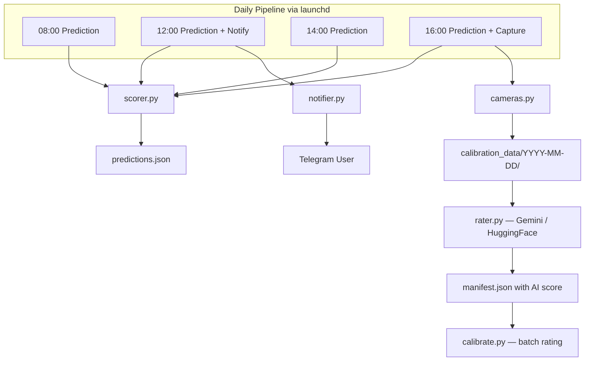

# Sunset Predictor -- Full Project Spec

## Context

A sunset quality predictor for Tel Aviv that scores sunsets 1-10 using 8 weather factors, captures webcam frames around sunset, and runs as an automated daily pipeline via macOS launchd. The project needs to become (a) a real product someone uses daily and (b) a portfolio piece that tells a compelling technical story.

## What Already Works (Do Not Rebuild)

- 8-factor weighted scoring engine with directional western sky queries (`sunset_predictor/scorer.py`)
- Open-Meteo weather + air quality fetching (`sunset_predictor/fetcher.py`)
- Sun geometry and western sky point calculation (`sunset_predictor/sun.py`)
- Webcam capture via YouTube thumbnail trick, 6 cameras (`sunset_predictor/cameras.py`)
- Daily pipeline with 4 launchd triggers at 08:00, 12:00, 14:00, 16:00 (`daily_sunset.py`)
- Multi-timepoint predictions with spread tracking
- Human rating CLI (`rate_day.py`) and retrospective reports (`retro_review.py`)
- Backtesting against historical data (`backtest.py`)
- Calibration data pipeline with 20+ days of data

---

## Feature 1: Telegram Notification

**Goal:** Turn the terminal script into something a user actually receives. A daily push message at noon telling you whether tonight's sunset is worth making plans for.

**Scope:**

- Send-only: one message per day, triggered by the noon (12:00) launchd run
- Text only, no images
- Message includes: score, verdict, per-factor breakdown, sunset time, comfort warnings (wind/cold)
- Gracefully no-op if Telegram credentials are not configured

**What already exists:** `sunset_predictor/notifier.py` and the `--notify` flag in `daily_sunset.py` are already implemented. The `.env` has placeholder keys.

**Remaining work:**

- Update the noon launchd plist (`com.sunset.noon.plist`) to pass `--notify` flag
- Configure the bot: create via @BotFather, get token and chat_id, populate `.env`
- Test end-to-end with a real Telegram delivery

**Out of scope for now:**

- `/predict` on-demand command
- Image attachments
- Multiple recipients / channel broadcasting
- Message copy polish (will iterate on wording later)

---

## Feature 2: Vision AI Calibration Loop

**Goal:** Close the "model learns from reality" feedback loop. The scoring engine predicts sunset quality; webcam images capture what actually happened; Vision AI rates the actual result; the delta informs calibration.

**Scope:**

- Gemini 2.0 Flash as primary rater (free tier: 15 req/min)
- HuggingFace Inference API as fallback when Gemini quota is exhausted (BLIP-2 or similar vision-language model, free, no API key required for public models)
- A `calibrate.py` script that:
  - Takes a date (or defaults to today)
  - Loads that day's captured images from `calibration_data/YYYY-MM-DD/`
  - Runs Vision AI rating (Gemini -> HuggingFace fallback)
  - Writes the AI score back into `manifest.json`
- Wire `rate_images_if_possible()` in `daily_sunset.py` into the capture flow (it exists but is never called)

**What already exists:** `sunset_predictor/rater.py` has `rate_single_image()` and `rate_sunset_images()` using Gemini. The prompt engineering and JSON parsing are done.

**Remaining work:**

- Add HuggingFace fallback path to `sunset_predictor/rater.py`
- Create `calibrate.py` as a standalone script for batch rating
- Call `rate_images_if_possible()` after capture in `daily_sunset.py` and pass result to `save_manifest()`
- Run the rater on existing `calibration_data/` images to produce at least one successful calibration example

**Out of scope:**

- Automatic weight adjustment based on AI ratings (future work)
- Training a custom model

---

## Feature 3: Light Codebase Cleanup

**Goal:** Remove confusion, dead code, and doc drift. Do NOT merge or restructure files.

**Scope:**

- Remove `OPENWEATHERMAP_API_KEY` from `.env` and `config.py` (nothing uses it; Open-Meteo replaced it)
- Fix the `capture_sunset.py --rate` stub that references wrong API keys -- either wire it to the real Gemini rater or remove the `--rate` flag
- Update `README.md` to reflect reality: 4 launchd jobs (not 3), correct times, correct feature list
- Update `TESTING.md` to match current job count and pipeline behavior

**Explicitly NOT doing:**

- Merging `capture_sunset.py` into `daily_sunset.py`
- Changing data formats (`prediction.json` vs `predictions.json`)
- Refactoring the scoring engine

---

## Feature 4: GitHub Repo + README

**Goal:** A portfolio artifact that communicates the full story in 5 minutes to a technical interviewer.

**Scope:**

- `git init`, `.gitignore` (exclude `.env`, `calibration_data/`, `__pycache__/`, `.DS_Store`, `launchd_*.log`)
- Push to GitHub as `sunset-predictor`
- README structure:
  - One-line hook: what this is and why it's interesting
  - How the scoring model works -- highlight the counter-intuitive insights (cirrus clouds GOOD, clean air SLIGHTLY BAD, moderate aerosols enhance color)
  - Architecture overview (mermaid diagram showing the daily pipeline, capture, Vision AI loop)
  - Calibration loop explanation: predict -> capture -> Vision AI rate -> compare -> adjust
  - Tech stack callout: no paid APIs, all free tier, runs locally on macOS
  - Screenshot of a Telegram message (once working)
  - How to set up and run
- Keep calibration data out of the repo but include a `calibration_data/example/` with one sanitized day's data as a sample

---

## Feature 5: Future Vision Document

**Goal:** Show product thinking beyond engineering. This is what separates a PM from a developer in portfolio context.

**Scope:** Create `docs/future_vision.md` covering:

- **Instagram auto-posting** -- daily post with score + best webcam frame + CTA
- **Push notification app** -- location-based alerts at optimal time. Revenue angle: local business ads (rooftop bars, beach restaurants)
- **Multi-city expansion** -- same model, any coastal city. API: `GET /predict?lat=X&lon=Y`
- **Community calibration flywheel** -- users submit photos -> more Vision AI ground truth -> better model -> more engaged users
- Keep it to one page. Concrete enough to be credible, aspirational enough to show vision.

---

## Architecture After All Features

---

## Testing Strategy

Full TDD. All new code requires a failing test first. Retrofit tests on the scorer (core logic).

- Test framework: `pytest` in `tests/`
- Scorer: boundary-value tests for all 8 scoring functions, weighted scoring, verdicts
- Notifier: message formatting, comfort warnings
- Rater: response parsing, fallback logic, score aggregation
- Calibrate: manifest I/O, date parsing
- Run: `python3 -m pytest tests/ -v`

## Execution Order

1. **Test infrastructure + scorer tests** -- establish TDD foundation, retrofit scorer tests
2. **Telegram notification** -- highest leverage, makes the POC real (configure bot, update plist, test delivery)
3. **Vision AI loop** -- add HuggingFace fallback, create calibrate.py, wire into pipeline, run on existing images (TDD for all new code)
4. **Light cleanup** -- remove dead code, fix docs
5. **GitHub repo + README** -- the portfolio piece (do after everything works so README reflects truth)
6. **Future vision doc** -- write last, after you can screenshot the working bot

---

## Parking Lot (Out of Scope)

- On-demand `/predict` Telegram command
- Multiple recipients / Telegram channel
- Message copy and tone iteration
- Automatic weight tuning from AI ratings
- Multi-city support
- Web dashboard
- Custom ML model for sunset rating
- Consolidating `capture_sunset.py` and `daily_sunset.py`
